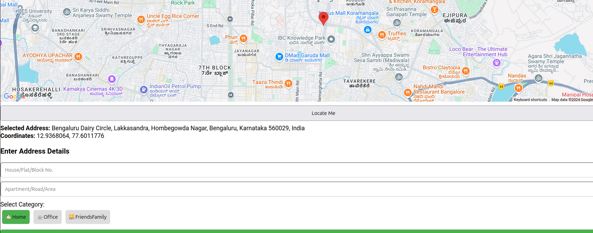
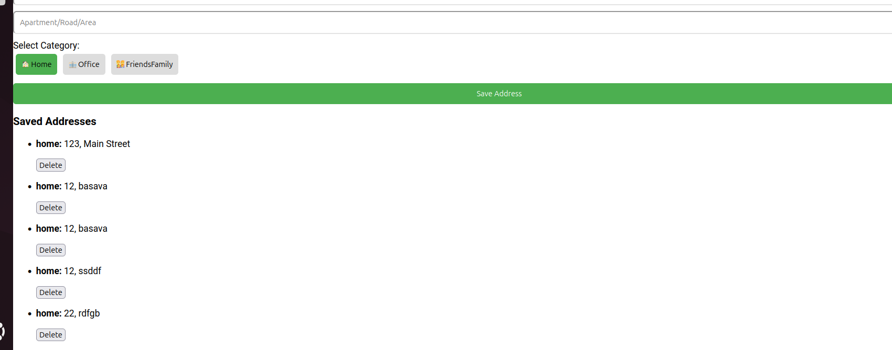

# Location Address Flow

A web application for managing user locations and addresses built with React, Node.js, Express, and MySQL. The app allows users to detect their location automatically or manually search for an address, save it under different categories (Home, Office, Friends & Family), and manage saved addresses in a MySQL database.

---

## Features

- **Location Detection**: Automatically fetch the user's current location or allow manual address search.
- **Address Form**: Users can input details like House No., Area, and Category (Home, Office, Friends & Family).
- **Address Management**: Users can view, edit, and delete saved addresses.
- **Responsive**: Optimized for desktop and mobile devices.

---

## Technologies Used

- **Frontend**: React.js, Google Maps API
- **Backend**: Node.js, Express.js
- **Database**: MySQL
- **Others**: Axios (for HTTP requests)

---

## Installation

1. **Clone the repository**

    ```bash
    git clone https://github.com/Imbasava/Location-Address-Flow.git
    cd Location-Address-Flow
    ```

2. **Install Dependencies**

    ### Backend

    Navigate to the backend directory and install the dependencies:

    ```bash
    cd backend
    npm install
    ```

    ### Frontend

    Navigate to the frontend directory and install the dependencies:

    ```bash
    cd frontend
    npm install
    ```
3. **Setup MySQL Database**

    Create the `location_address_flow` database and run the following query to create the `addresses` table:

    ```sql
    CREATE TABLE addresses (
        id INT AUTO_INCREMENT PRIMARY KEY,
        houseNo VARCHAR(255) NOT NULL,
        area VARCHAR(255) NOT NULL,
        category VARCHAR(50) NOT NULL,
        latitude DECIMAL(9,6),
        longitude DECIMAL(9,6)
    );
    ```

4. **Configure the Environment**

    ### Backend

    Create a `.env` file in the backend directory with the following details:

    ```env
    DB_HOST=localhost
    DB_USER=root
    DB_PASSWORD=your_password
    DB_NAME=location_address_flow
    ```

    Configure your MySQL database credentials in `db.js`:

    ```javascript
    // backend/db.js
    const mysql = require('mysql2');
    const db = mysql.createConnection({
      host: process.env.DB_HOST,
      user: process.env.DB_USER,
      password: process.env.DB_PASSWORD,
      database: process.env.DB_NAME,
    });

    module.exports = db;
    ```

    Ensure your MySQL database is running, and the database `location_address_flow` is created.

    ### Frontend

    Add your Google Maps API key to the environment. Create a `.env` file in the frontend directory with or can be inlucded in the public index.html:

    ```env
    https://maps.googleapis.com/maps/api/js?key=AIzaSyB3G8KXE6Fewas-______-TBFz4z6ZY&libraries=places
    ```

5. **Run the Application**

    ### Backend

    ```bash
    cd backend
    npm start
    ```

    ### Frontend

    ```bash
    npm start
    ```

## API Endpoints

### Address Management

- **Save Address:** POST `/api/addresses/save`
- **Retrieve Addresses:** GET `/api/addresses/`
- **Delete Address:** DELETE `/api/addresses/delete/:id`
- **Update Address:** PUT `/api/addresses/update/:id`

  


## Project Structure

### Frontend

```plaintext
frontend/
├── src/
│   ├── components/
│   │   ├── LocationSearchMap.js
│   │   ├── AddressForm.js
│   │   └── AddressManagement.js
│   ├── App.js
│   └── index.js
├── public/
│   └── index.html
```
### Backend
``` plaintext
backend/
├── routes/
│ └── addresses.js
├── db.js
├── server.js
└── .env
```
## Usage

1. Detect or manually search for a location.
2. Save the location with additional address details.
3. View or manage saved addresses in the Address Management section.

## Contributing

Feel free to fork the repository and submit pull requests. Follow the GitHub flow for contributions.

## License

This project is licensed under the MIT License.
